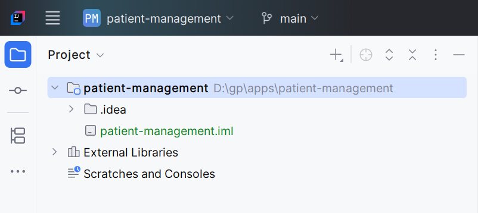

# Project Setup

## Project Metadata

- repository: D:\gp\apps\patient-management

## Main Project Creation Steps

The main project was created using IntelliJ, following the below steps \
`File > New project > Empty Project `

- Name: patient-management
- Location: `D:\gp\apps`

Click `Create` \
You should see the folder structure similar to the one below: \

Next we will create a module. \

### Module Creation

Since we are using intellij community edition, I will use vs code to create the module project

1. Open the above project in vs code
1. Press Ctrl+Shift+p and type `Spring Initializr: Create a Maven project`
1. enter artifact id as `patient-service`
1. for the dependencies add the following:
   - spring web
   - spring data jpa
   - spring boot devtools
   - postgresql driver
   - validation
   - H2 Database

## Credits

> https://youtu.be/tseqdcFfTUY
