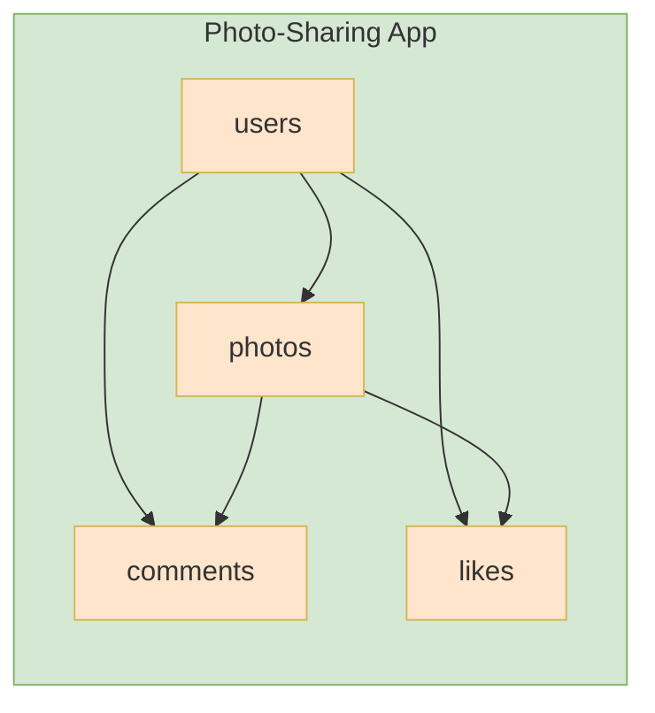

# Photo Sharing App - DB Design

Let's design the database of a photo sharing app.

Q1. What type of things we are storing?
- users
- photo
- comments
- likes

Q2. What properties does each thing have?

Q3. What type of data does each property contains?

## Rough ER Diagram

 
## Relationships

1. Between user and photos: A user has many photos so this is a 1 to many relationship.
2. Between photos and user: looking from the perspective of photo, we have many to 1 relationship.
3. Between a photo and comments: 1 to many as a photo has many comments.
4. Between comments and a photo: many to 1.
5. Between a user and likes: 1 to many

## Misc
- Some other forms of relationship
- 1 to 1 example: a boat has a captain | a company has a CEO | a driver has a license
- Many to Many: tasks and engineers | a task can be worked by many engineers and one engineer can work on many tasks | students and classes, a student can attend many classes and a class has many students.
