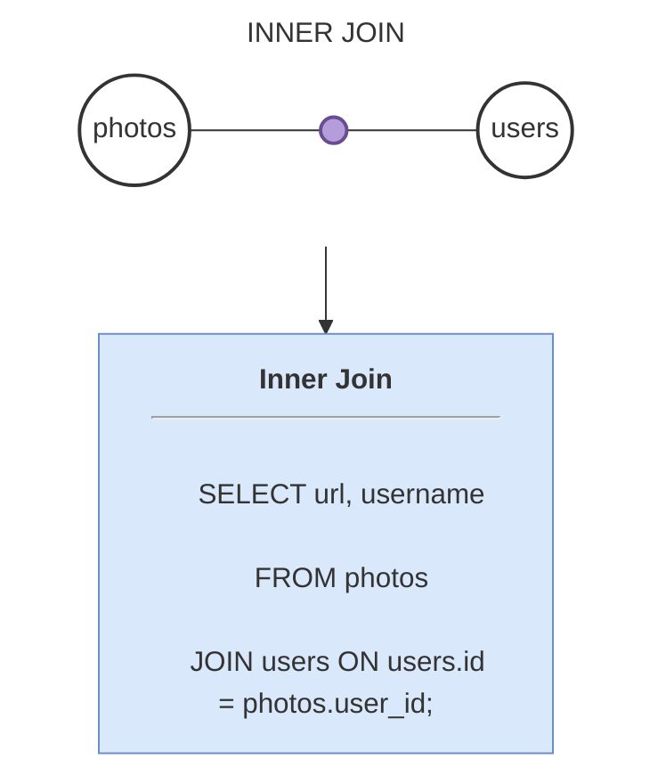
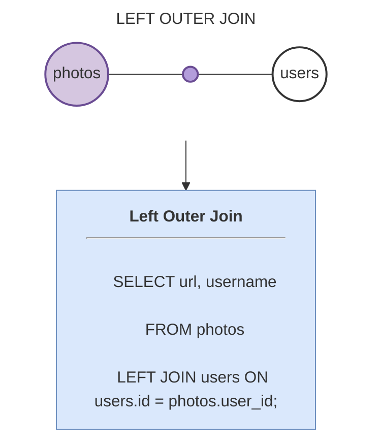
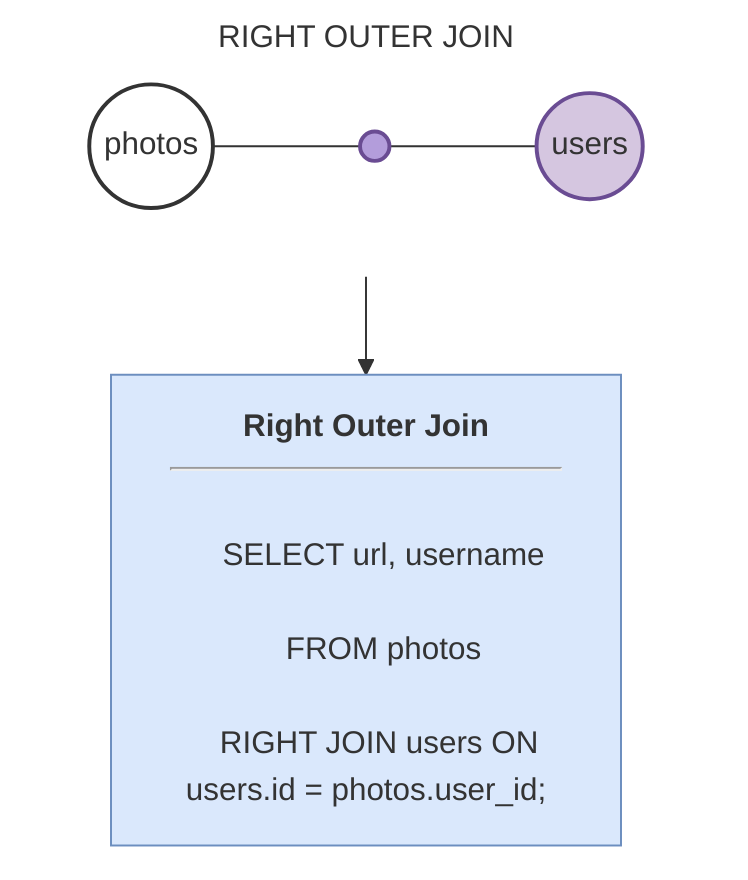
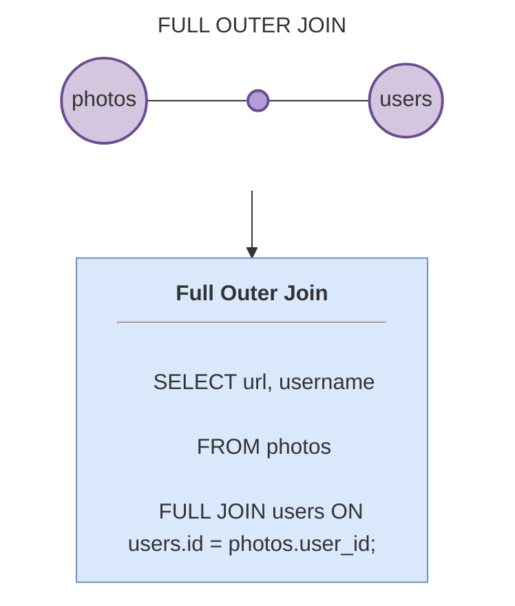

# Types of JOINS

## Inner Join
- Let's analyse this from the context of photos and users table.
- Earlier we ran the below query which is an inner join.
```sql
SELECT url, username
FROM photos
JOIN users ON users.id = photos.user_id;
```



- So here only those records in photos  table which has a corresponding record in users table will be shown.
- In the perspective of set theory this is `Intersection`
- This is `INNER JOIN` which you can use interchangeably with just `JOIN`


## Left Join also know as Left Outer Join
- Let's apply left join on the same query above.
```sql
SELECT
  url,
  username
FROM
  photos
  LEFT JOIN users ON users.id = photos.user_id;
```


- So it will return all the records on the photos table mapped with the associated records in the users table.
- If a photo is not associated with any user then user details (like username) will be considered `NULL`

## Right Join also known as Right Outer Join
- It is similar to Left Outer Join but here we will consider all the records of users table instead of photos table.
- If a user has not posted any photos then photo details will be considered `NULL`.
```sql
INSERT INTO users(username)
VALUES ('allen665');

SELECT
  url,
  username
FROM
  photos
  RIGHT JOIN users ON users.id = photos.user_id;
SELECT * FROM users;
```




## Full Join also known as Full Outer Join
- Here we include all the records from both the tables
- Columns with no matching records on the either table will be set as `NULL`
```sql

SELECT
  url,
  username
FROM
  photos
  FULL JOIN users ON users.id = photos.user_id;
SELECT * FROM users;
```


