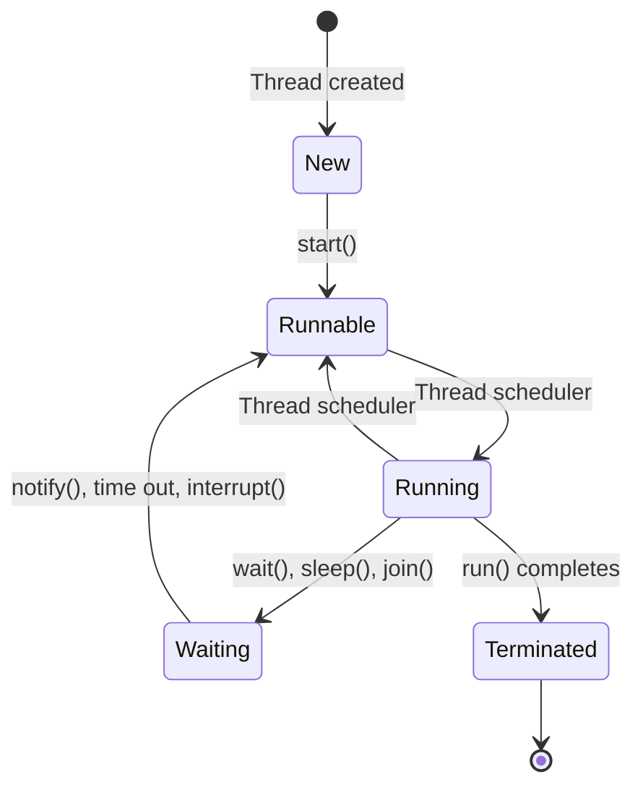

# Thread Lifecycle

## What is a Thread?

A thread is the smallest unit of execution within a program. It represents an independent path of execution within a program, allowing multiple operations to run concurrently. Each thread has its own call stack but can share resources like memory and files with other threads in the same process.

Think of a process as a container that holds all the resources needed to execute a program, while threads are the actual workers that execute the code within that process.

## Thread States and Lifecycle

A thread in Java goes through various states throughout its lifecycle. Understanding these states is crucial for effective multithreading. Here are the main states:

1. **New (Born)** 
   - Thread is created but not yet started
   - `Thread t = new Thread()` creates thread in this state
   - No system resources allocated yet

2. **Runnable**
   - Thread is ready to run and is waiting for CPU
   - Moves to this state after `t.start()` is called
   - Thread scheduler may pick it for execution

3. **Running**
   - Thread is currently being executed by CPU
   - Only one thread can be running per CPU core at a time
   - Thread scheduler decides which runnable thread gets to run

4. **Waiting/Blocked/Sleeping**
   - Thread is temporarily not running
   - Can be waiting for:
     - I/O operations to complete
     - Another thread to finish (using `join()`)
     - Lock to be released (for synchronized code)
     - Sleep time to complete (`Thread.sleep()`)
     - Notification from another thread (`wait()` and `notify()`)

5. **Terminated (Dead)**
   - Thread has completed its execution
   - Can occur when:
     - `run()` method completes normally
     - Uncaught exception occurs
   - Cannot be restarted once terminated

### State Transitions Diagram

### Common Methods That Affect Thread State

- `start()`: Moves thread from New to Runnable state
- `sleep(long millis)`: Temporarily stops thread execution for specified time
- `wait()`: Puts thread in waiting state until `notify()` or `notifyAll()` is called
- `join()`: Current thread waits for the joined thread to die
- `yield()`: Hints to scheduler that thread can be rescheduled
- `interrupt()`: Interrupts a waiting/sleeping thread

